# Лабораторная работа № 1. Принятие решений на основе метода Монте-Карло

Дисциплина «Базы знаний и принятие проектных решений в САПР», **вариант 3**.
Лабораторная работа № 1 соответствует лабораторной работе № 5 методического пособия `pract.pdf`.

Программа моделирует входной контроль резисторов и показывает, какую долю резисторов
выгодно проверять на входе, чтобы общие затраты были наименьшими. Расчёт дублируется
книгой Excel с живыми формулами — это независимая проверка результата.

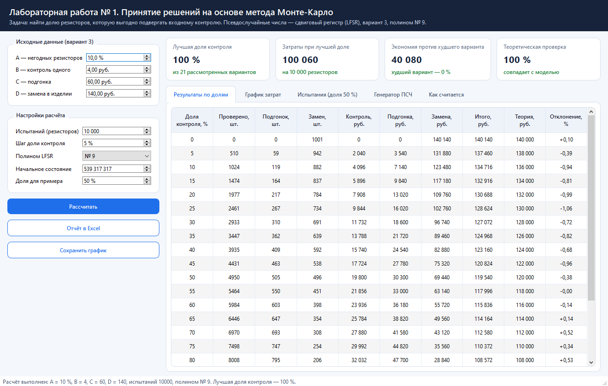

---

## Содержание

1. [Условие задачи](#условие-задачи)
2. [Быстрый старт](#быстрый-старт)
3. [Как пользоваться программой](#как-пользоваться-программой)
4. [Что внутри: теория и алгоритм](#что-внутри-теория-и-алгоритм)
5. [Генератор псевдослучайных чисел](#генератор-псевдослучайных-чисел)
6. [Результаты расчёта](#результаты-расчёта)
7. [Проверка в Excel](#проверка-в-excel)
8. [Структура проекта](#структура-проекта)
9. [Тесты](#тесты)
10. [Ответ на вопрос задачи](#ответ-на-вопрос-задачи)

---

## Условие задачи

На предприятие радиоэлектронной промышленности поступают резисторы с номиналом невысокой
точности. Примерно **A %** из них не подходят для изготовления продукции и требуют подгонки.
Чтобы выявить такие резисторы, нужен входной контроль:

* контроль одного резистора стоит **B** рублей;
* подгонка выявленного резистора стоит **C** рублей;
* если негодный резистор не выявили и установили в изделие, его замена стоит **D** рублей.

Требуется найти, какую часть резисторов подвергать входному контролю, чтобы общие затраты
на контроль и подгонку были наименьшими. Псевдослучайные числа формируются регистром сдвига
с линейной обратной связью (LFSR) по заданному полиному.

### Исходные данные варианта 3

| Параметр | Значение | Смысл |
|---|---:|---|
| A | 10 % | доля резисторов, требующих подгонки |
| B | 4 руб. | стоимость контроля одного резистора |
| C | 60 руб. | стоимость подгонки выявленного резистора |
| D | 140 руб. | стоимость замены резистора в готовом изделии |
| Полином | № 9 | `X^32 + X^31 + X^27 + X^26 + X^23 + X^22 + X^19 + X^18 + X^17 + X^16 + X^15 + X^12 + X^9 + X^8 + X^6 + X^5 + X^4 + X^3 + X^2 + X + 1` |

Доля контроля перебирается от 0 до 100 % с шагом 5 %, на каждую долю приходится 10 000 испытаний
(это число можно менять в окне программы).

---

## Быстрый старт

Нужен Python версии 3.10 или новее. Проверить версию:

```bash
python --version
```

Если Python не установлен, его можно взять на [python.org](https://www.python.org/downloads/).
При установке на Windows отметьте галочку «Add Python to PATH».

### Windows (PowerShell или командная строка)

```bat
git clone https://github.com/dezshev/BZiPPRvSAPR-labs.git
cd BZiPPRvSAPR-labs
git checkout lab1

python -m venv .venv
.venv\Scripts\activate

pip install -r requirements.txt
python main.py
```

### Linux или macOS

```bash
git clone https://github.com/dezshev/BZiPPRvSAPR-labs.git
cd BZiPPRvSAPR-labs
git checkout lab1

python3 -m venv .venv
source .venv/bin/activate

pip install -r requirements.txt
python main.py
```

После запуска открывается окно программы, расчёт с параметрами варианта 3 выполняется сразу.

> Если репозиторий скачан архивом (кнопка «Code» → «Download ZIP»), шаги с `git` не нужны:
> распакуйте архив, откройте папку в терминале и начните с команды `python -m venv .venv`.

### Что устанавливается

| Пакет | Зачем |
|---|---|
| `PySide6` | окно программы, таблицы, вкладки |
| `matplotlib` | графики затрат и распределения чисел |
| `openpyxl` | запись книги Excel с формулами |

---

## Как пользоваться программой

1. **Слева** задаются исходные данные (A, B, C, D) и настройки расчёта: число испытаний,
   шаг перебора доли контроля, номер полинома, начальное состояние регистра.
2. Кнопка **«Рассчитать»** запускает моделирование. Расчёт идёт в отдельном потоке,
   окно не подвисает.
3. **Карточки сверху** показывают главное: лучшую долю контроля, затраты при ней,
   экономию против худшего варианта и лучшую долю по теоретической формуле.
4. Кнопка **«Отчёт в Excel»** сохраняет книгу с проверкой, кнопка **«Сохранить график»** — картинку графика.

### Вкладка «Результаты по долям»

Для каждой доли контроля видно, сколько резисторов проверено, сколько подогнано, сколько
заменено в изделиях, и как раскладываются затраты. Зелёным выделена лучшая строка,
последний столбец показывает отклонение моделирования от теоретической формулы.


### Вкладка «График затрат»

Синяя линия — результат моделирования, серая пунктирная — теоретическая формула,
зелёная точка — найденный минимум.

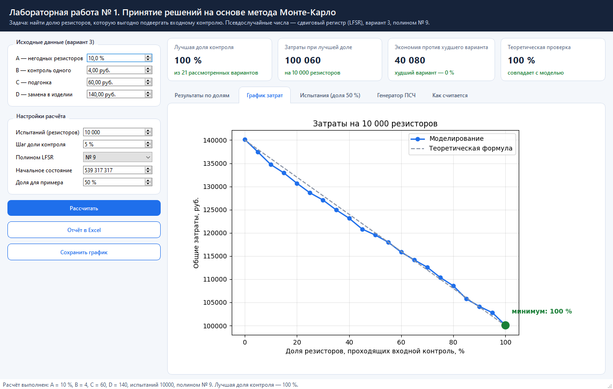

### Вкладка «Испытания»

Подробная таблица первых испытаний, как таблица 1 в методических указаниях: числа R1 и R2,
попал ли резистор на контроль, годен ли он, затраты по этому резистору и нарастающий итог.
Оранжевым отмечены испытания, в которых возникли затраты.

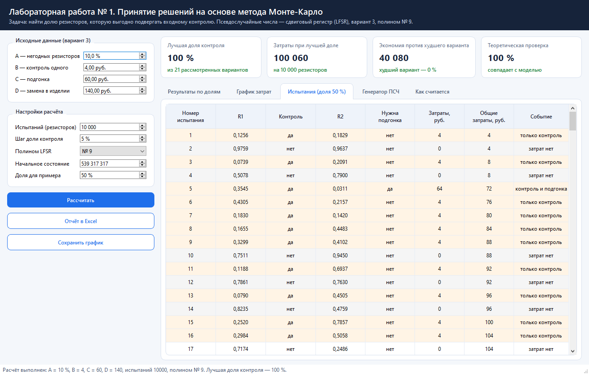

### Вкладка «Генератор ПСЧ»

Гистограмма распределения чисел, поле пар (R1, R2) и показатели качества генератора.

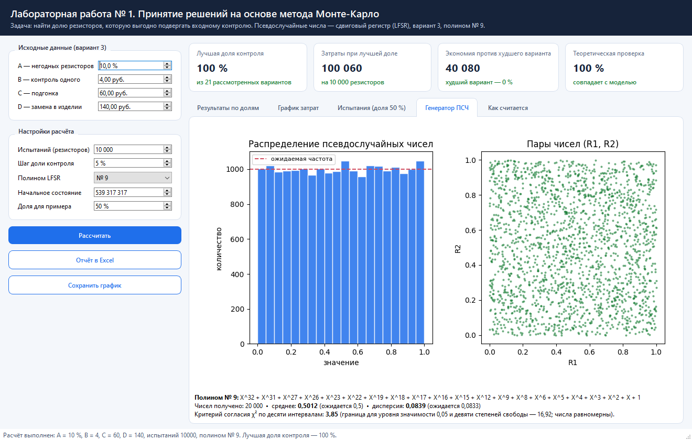

### Вкладка «Как считается»

Краткое описание алгоритма прямо в программе, чтобы не искать его в отчёте.

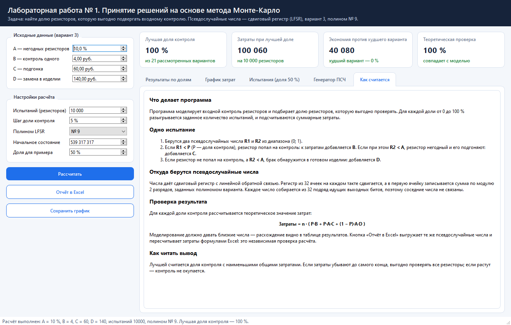

---

## Что внутри: теория и алгоритм

### Метод Монте-Карло

Метод основан на многократном случайном розыгрыше вариантов. Вместо того чтобы выводить
формулу, процесс проигрывается много раз со случайными числами, а затем берётся средний
результат. Чем больше испытаний, тем ближе результат к истинному значению.

В этой задаче разыгрывается судьба каждого резистора: попал ли он на контроль и годен ли он.

### Одно испытание

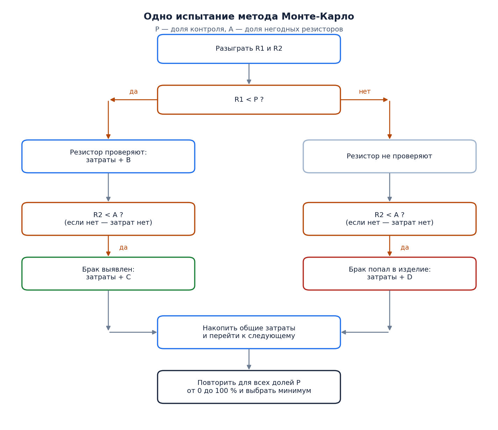

Словами:

1. Разыгрываются два числа R1 и R2 из диапазона (0; 1).
2. Если **R1 < P** (P — доля контроля), резистор попадает на контроль: к затратам прибавляется **B**.
   Если при этом **R2 < A**, резистор негодный и его подгоняют: прибавляется **C**.
3. Если резистор не попал на контроль, а **R2 < A**, брак обнаружится уже в изделии:
   прибавляется **D**.

Шаги повторяются для всех испытаний, затем доля P увеличивается на шаг, и всё повторяется снова.
Выбирается доля с наименьшими общими затратами.

### Теоретическая проверка

Для этой задачи легко записать ожидаемые затраты на n резисторов:

```
Затраты(P) = n · ( P·B + P·A·C + (1 − P)·A·D )
```

Для варианта 3: `Затраты(P) = n · (4P + 0,1·60·P + 0,1·140·(1 − P)) = n · (14 − 4P)`.

Выражение убывает с ростом P, значит теоретический минимум — при P = 100 %.
Моделирование должно давать близкие числа: в программе это столбцы «Теория» и «Отклонение».

### Из чего складываются затраты

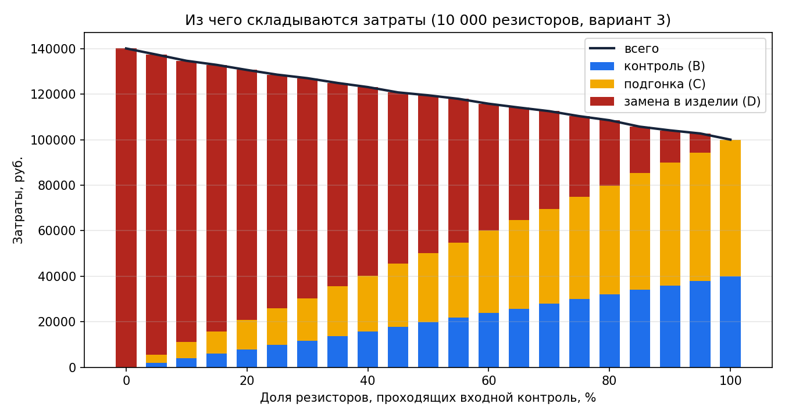

Чем больше доля контроля, тем больше платим за сам контроль и подгонку (синий и жёлтый),
но тем меньше платим за замену брака в готовых изделиях (красный). Для варианта 3 замена
настолько дороже контроля, что суммарные затраты убывают до самого конца.

---

## Генератор псевдослучайных чисел

Числа даёт регистр сдвига с линейной обратной связью: 32 ячейки, на каждом такте содержимое
сдвигается, а в первую ячейку записывается сумма по модулю 2 разрядов, отмеченных полиномом варианта.

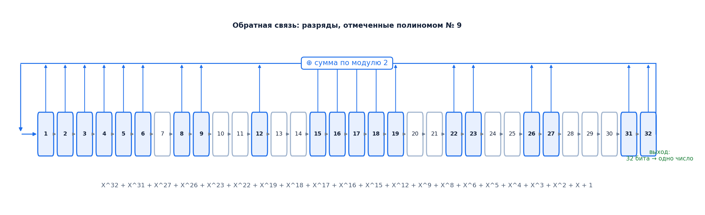

Одно псевдослучайное число собирается из 32 подряд идущих выходных битов и делится на 2³²,
поэтому оно попадает в диапазон (0; 1), а соседние числа не связаны между собой.

Качество чисел проверяется прямо в программе:

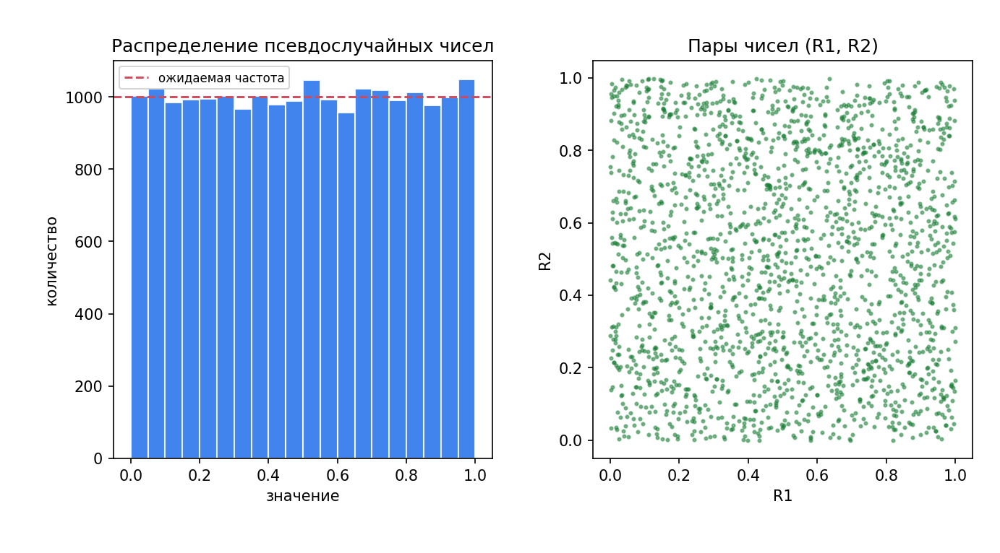

| Показатель | Получено | Ожидается |
|---|---:|---|
| Среднее | 0,5012 | 0,5 |
| Дисперсия | 0,0834 | 0,0833 |
| χ² по десяти интервалам | 3,85 | меньше 16,92 при уровне значимости 0,05 |

Все три показателя в норме, значит числа можно считать равномерными.

---

## Результаты расчёта

Параметры варианта 3, 10 000 испытаний на каждую долю, начальное состояние регистра 539 317 317.

| Доля контроля, % | Проверено | Подгонок | Замен | Затраты, руб. | Теория, руб. | Отклонение, % |
|---:|---:|---:|---:|---:|---:|---:|
| 0 | 0 | 0 | 1001 | 140 140 | 140 000 | +0,10 |
| 5 | 510 | 59 | 942 | 137 460 | 138 000 | −0,39 |
| 10 | 1024 | 119 | 882 | 134 716 | 136 000 | −0,94 |
| 15 | 1474 | 164 | 837 | 132 916 | 134 000 | −0,81 |
| 20 | 1977 | 217 | 784 | 130 688 | 132 000 | −0,99 |
| 25 | 2461 | 267 | 734 | 128 624 | 130 000 | −1,06 |
| 30 | 2933 | 310 | 691 | 127 072 | 128 000 | −0,72 |
| 35 | 3447 | 362 | 639 | 124 968 | 126 000 | −0,82 |
| 40 | 3935 | 409 | 592 | 123 160 | 124 000 | −0,68 |
| 45 | 4431 | 463 | 538 | 120 824 | 122 000 | −0,96 |
| 50 | 4950 | 505 | 496 | 119 540 | 120 000 | −0,38 |
| 55 | 5464 | 550 | 451 | 117 996 | 118 000 | −0,00 |
| 60 | 5984 | 603 | 398 | 115 836 | 116 000 | −0,14 |
| 65 | 6446 | 647 | 354 | 114 164 | 114 000 | +0,14 |
| 70 | 6970 | 693 | 308 | 112 580 | 112 000 | +0,52 |
| 75 | 7498 | 747 | 254 | 110 372 | 110 000 | +0,34 |
| 80 | 8008 | 795 | 206 | 108 572 | 108 000 | +0,53 |
| 85 | 8505 | 855 | 146 | 105 760 | 106 000 | −0,23 |
| 90 | 8999 | 900 | 101 | 104 136 | 104 000 | +0,13 |
| 95 | 9478 | 941 | 60 | 102 772 | 102 000 | +0,76 |
| **100** | **10000** | **1001** | **0** | **100 060** | **100 000** | **+0,06** |

Моделирование отличается от теоретической формулы не более чем на 1,1 % — это обычная
для метода Монте-Карло погрешность при 10 000 испытаний. Если увеличить число испытаний,
отклонение уменьшится.

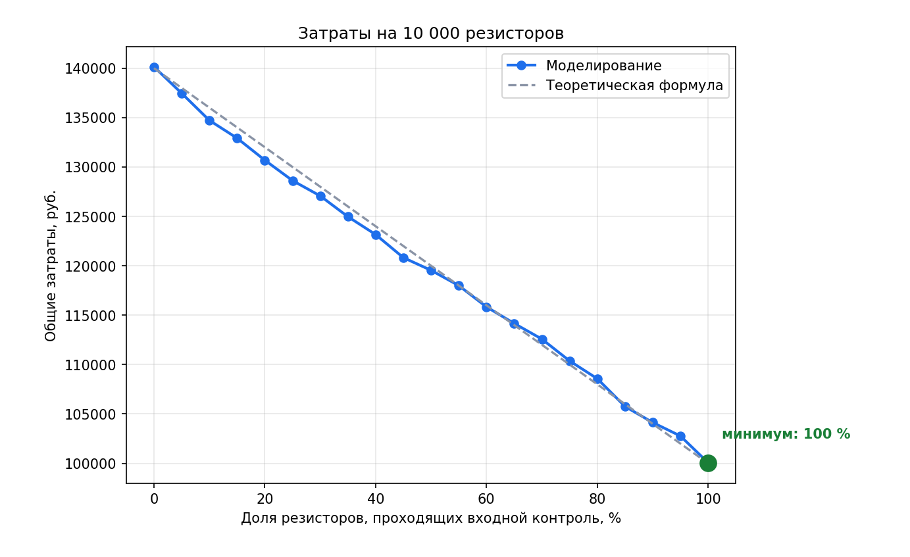

---

## Проверка в Excel

Кнопка «Отчёт в Excel» сохраняет книгу из четырёх листов:

| Лист | Что содержит |
|---|---|
| **Параметры** | исходные данные; на них ссылаются формулы остальных листов |
| **Испытания** | те же числа R1 и R2, что использовала программа, и формулы затрат для каждой доли контроля |
| **Свод** | сравнение затрат программы и формул Excel, теоретические значения, график |
| **Пример испытаний** | подробная таблица испытаний, как таблица 1 в методических указаниях |

Главный лист — «Свод». Столбец B заполняет программа, столбец C считает Excel по формулам
на листе «Испытания». Совпадение столбцов означает, что расчёт верен.

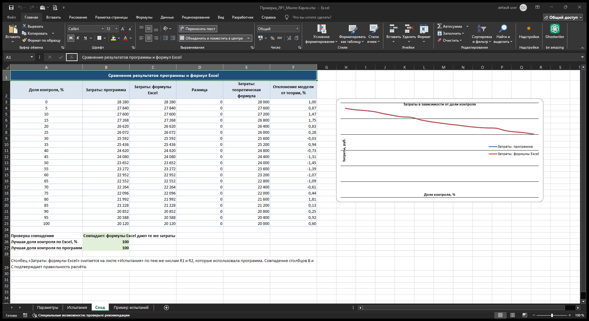

Формула затрат в каждой ячейке листа «Испытания» повторяет правило испытания:

```
=ЕСЛИ($B4<D$2;ЗатрКонтроль;0)
+ЕСЛИ(И($B4<D$2;$C4<Брак/100);ЗатрПодгонка;0)
+ЕСЛИ(И($B4>=D$2;$C4<Брак/100);ЗатрЗамена;0)
```

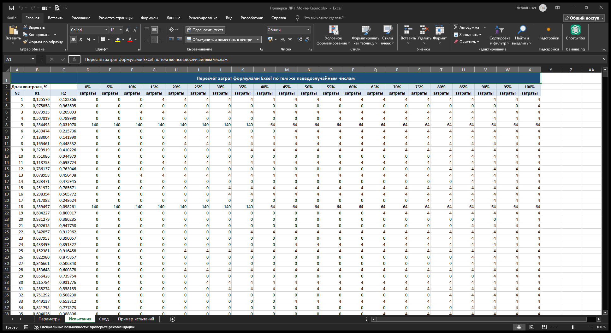

Готовый пример отчёта лежит в репозитории: [`docs/example/Проверка_ЛР1_Монте-Карло.xlsx`](docs/example).
В нём проверка даёт «Совпадает: формулы Excel дают те же затраты», а лучшая доля контроля
и по программе, и по Excel равна 100 %.

> В отчёт выгружаются первые 2000 испытаний (чтобы файл оставался лёгким), и программа
> пересчитывает свои итоги ровно по этим же строкам — поэтому столбцы сравнимы напрямую.

---

## Структура проекта

```
BZiPPRvSAPR-labs (ветка lab1)
├── main.py                      запуск приложения
├── requirements.txt             список зависимостей
├── montecarlo/
│   ├── lfsr.py                  генератор псевдослучайных чисел на регистре сдвига
│   ├── model.py                 модель контроля резисторов и перебор долей
│   ├── excel_report.py          книга Excel с формулами для проверки
│   └── ui.py                    окно программы
├── tools/
│   ├── make_docs_images.py      рисунки для этого файла
│   ├── make_screenshots.py      снимки окна программы
│   └── make_excel_screenshot.py пример отчёта и снимки Excel
├── tests/
│   └── test_lab1.py             проверки генератора и модели
└── docs/
    ├── img/                     картинки для README
    └── example/                 пример готового отчёта Excel
```

Каждый файл отвечает за одно: генератор чисел не знает про резисторы, модель не знает про
окно, окно не считает затраты само. Поэтому модель можно использовать отдельно, например так:

```python
from montecarlo.model import Parameters, simulate

result = simulate(Parameters(trials=100_000))
print(result.best.percent, result.best.total_cost)
```

---

## Тесты

Проверки написаны на стандартном модуле `unittest`, дополнительных пакетов не нужно:

```bash
python -m unittest discover -s tests -v
```

Что проверяется:

* числа генератора попадают в диапазон (0; 1), среднее и дисперсия близки к теоретическим;
* быстрый расчёт обратной связи через маску совпадает с прямым перебором отводов;
* регистр не зацикливается на коротком периоде;
* нулевое начальное состояние отклоняется с понятной ошибкой;
* затраты модели совпадают с ручным подсчётом по тем же числам;
* результат моделирования отличается от теоретической формулы меньше чем на 3 %.

---

## Ответ на вопрос задачи

Для варианта 3 выгодно подвергать входному контролю **все поступающие резисторы (100 %)**.
Затраты на 10 000 резисторов при этом составляют около **100 000 рублей** против 140 000 рублей
без контроля — экономия примерно **40 000 рублей**, то есть 29 %.

Причина видна из формулы `Затраты(P) = n · (14 − 4P)`: контроль одного резистора стоит 4 рубля,
а выявленный брак обходится в 60 рублей вместо 140 рублей замены в изделии. Каждый проверенный
резистор экономит в среднем 4 рубля, поэтому проверять выгодно всё.

---

## Другие лабораторные работы

Репозиторий общий для дисциплины, каждая лабораторная работа лежит в своей ветке:

| Ветка | Работа |
|---|---|
| `main` | описание репозитория и список работ |
| `lab1` | ЛР № 1 — метод Монте-Карло (эта ветка) |
| `lab2` | ЛР № 2 — методы принятия решений при многих критериях (метод ЭЛЕКТРА) |
